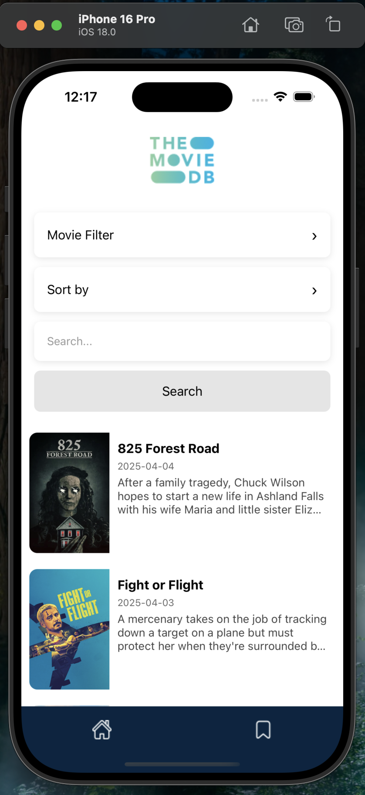
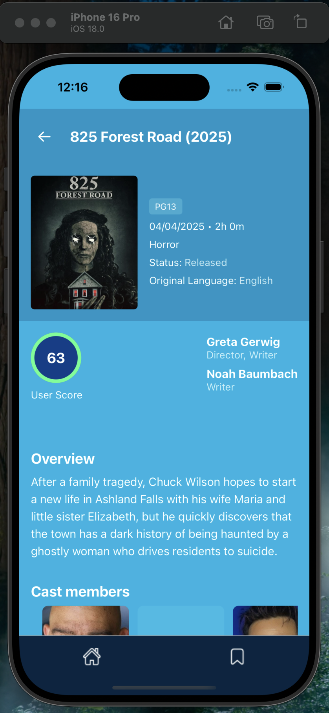
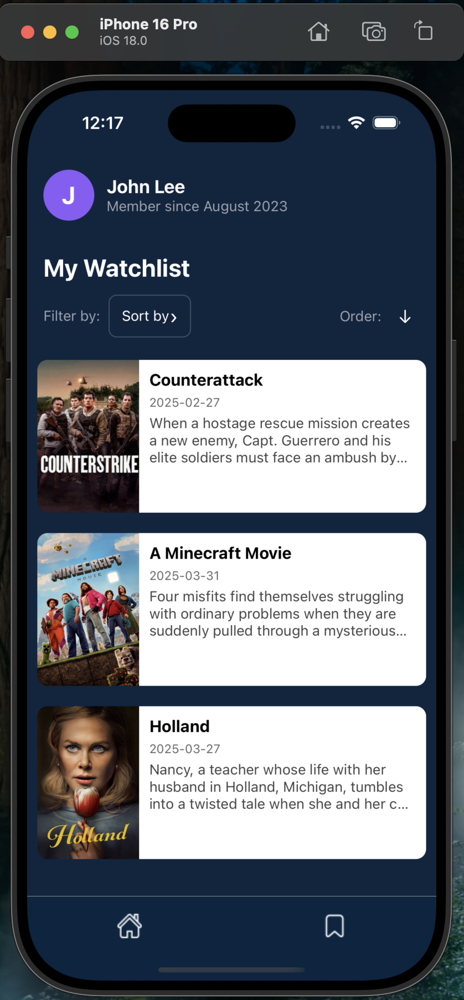

# Movie App

A React Native application for browsing and discovering movies use free API of ([Themoviedb](https://www.themoviedb.org/settings/api)).

## Prerequisites

- Node.js
- React Native development environment setup ([React Native Environment Setup](https://reactnative.dev/docs/environment-setup))
- For iOS: Xcode and CocoaPods
- For Android: Android Studio and Android SDK

## Setup env 
1. Go to [TMDB API Settings](https://www.themoviedb.org/settings/api)
2. Sign up or log in to your TMDB account
3. Request an API key (v4 auth)
4. Create a `.env` file in the root directory
5. Add your API key to the `.env` file:
```
TMDB_API_KEY=your_api_key_here
```

## Quick Start

1. Install dependencies:
```sh
npm install
# or
yarn install
```

2. iOS Setup (iOS only):
```sh
cd ios && pod install
```

3. Start the Metro bundler:
```sh
npm start
# or
yarn start
```

4. Run the app:

For iOS:
```sh
npm run ios
# or
yarn ios
```

For Android:
```sh
npm run android
# or
yarn android
```

## Features

<div style="display: flex; justify-content: space-between;">
  
  
  
</div>


- Get and search list of movies
- Filter movies 
- Add to watch list 

## Development

- Press `R` twice to reload the app
- Press `Cmd + M` (iOS) or `Ctrl + M` (Android) to open the developer menu

## Learn More

- [React Native Documentation](https://reactnative.dev/docs/getting-started)
- [React Native GitHub](https://github.com/facebook/react-native)
